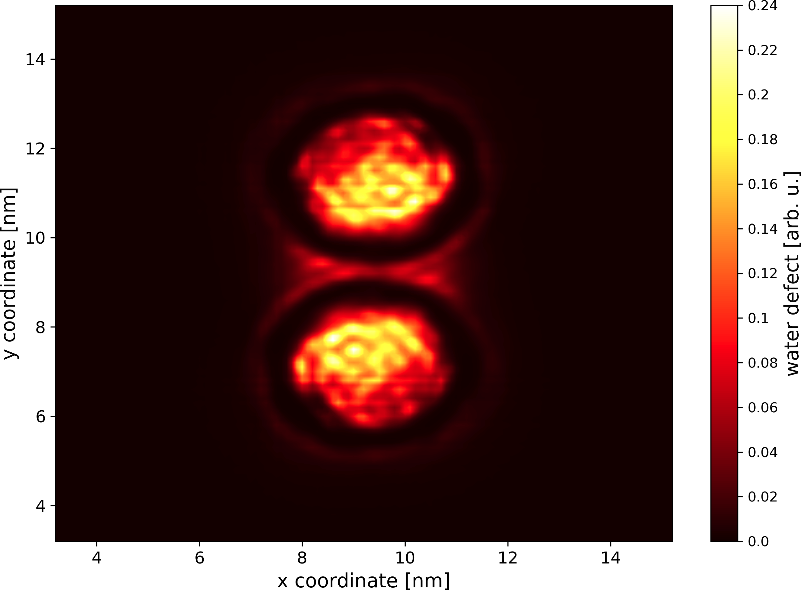

# memdian: Programs For MEMbrane DIsruption ANalysis

Memdian is a collection of several programs that might be useful for the analysis of membrane disruption. All the programs are built on top of [groan library](https://github.com/Ladme/groan) and can be used to analyze gromacs simulation trajectories.

The memdian programs have been written to analyze [Martini](http://cgmartini.nl/) simulations and the default values for options are set according to that. You can however use memdian to analyze _any_ simulation trajectories in Gromacs format, including different coarse-grained models or all-atom.

Note that when selecting beads (or atoms), memdian programs use the [groan selection language](https://github.com/Ladme/groan#groan-selection-language) that is very similar (but not identical) to the VMD selection language.

## Available programs

1) **memthick** calculates membrane thickness (phosphate-phosphate distance) across the entire membrane and writes the result as a plottable xy-map. (**Newer version available from [github.com/Ladme/memthick](https://github.com/Ladme/memthick).**)
2) **wdcalc** calculates water defect: a number of water beads/molecules inside a specified cylinder.
3) **wdmap** calculates water defect across the entire membrane and writes the result as a plottable xy-map.
4) **leafthick** calculates thickness of each membrane leaflet and writes the results as two plottable xy-maps.

## Dependencies

Memdian programs require you to have groan library installed. You can get groan from [here](https://github.com/Ladme/groan). See also the [installation instructions](https://github.com/Ladme/groan#installing) for groan.

## Installation

### Install all memdian programs

1) Run `make groan=PATH_TO_GROAN` to compile all memdian programs. `PATH_TO_GROAN` is a path to the directory containing groan library (containing `groan.h` and `libgroan.a`).
2) (Optional) Run `make install` to copy all the compiled binary files into `${HOME}/.local/bin`.

### Install a selected memdian program
1) Run `make NAME_OF_THE_PROGRAM groan=PATH_TO_GROAN` to compile a selected memdian program. For example, using `make wdmap groan=~/groan` will install the program `wdmap` while searching for the groan library in directory `~/groan`.
2) (Optional) Run `make install` to copy all compiled memdian programs into `${HOME}/.local/bin`.

## memthick

**⚠️ You may want to consider using the newer rewrite of `memthick` available from [github.com/Ladme/memthick](https://github.com/Ladme/memthick). ⚠️**
---

### How does it work

`memthick` generates a mesh for every membrane leaflet with bins every 0.1 nm and then calculates average z-position of phosphate beads in each bin from the simulation trajectory. Membrane thickness is then calculated for each bin as the difference between the average z-position of phosphates in the upper-leaflet bin and the average z-position of phosphates in the corresponding lower-leaflet bin.

### Options

```
Usage: memthick -c GRO_FILE -f XTC_FILE [OPTION]...

OPTIONS
-h               print this message and exit
-c STRING        gro file to read
-f STRING        xtc file to read
-n STRING        ndx file to read (optional, default: index.ndx)
-o STRING        output file name (default: membrane_thickness.dat)
-l STRING        specification of membrane lipids (default: Membrane)
-p STRING        specification of lipid phosphates (default: name PO4)
-x FLOAT-FLOAT   grid dimensions in x axis (default: box size from gro file)
-y FLOAT-FLOAT   grid dimensions in y axis (default: box size from gro file)
-a INTEGER       NAN limit: how many phosphates must be detected in a grid tile
                 to calculate membrane thickness for this tile (default: 30)
```

When specifying 'lipid phosphates' using the `-p` flag, note that `memthick` expects one 'lipid phosphate' per lipid molecule. In all-atom simulations, it is recommented to select phosphorus atoms of the membrane lipids.

When using `memthick` to analyze a membrane-protein simulation, it is a good idea to center the protein. Otherwise any interesting changes in the membrane thickness might get averaged out.

### Example

```
memthick -c system.gro -f md_centered.xtc -l "resname POPC" -x 0-13 -y "0 - 13" -a 15
```

`memthick` will load information about the atoms (but not atom coordinates) from `system.gro`. Every simulation frame saved in the trajectory `md_centered.xtc` will be analyzed. Analyzed part of the simulation box can be specified using the flags `-x` and `-y`. In this case, `memthick` will only analyze block-shaped area spanning from `0 nm` to `13 nm` on the x-axis and from `0 nm` to `13 nm` on the y-axis. The size of the area on the z-axis corresponds to the current size of the simulation box. Membrane thickness will not be calculated for bins with fewer than 15 samples (flag `-a`) in either leaflet (the resulting thickness will be 'nan' for these bins in the output file).

All atoms corresponding to residues named `POPC` will be considered to be lipid atoms and will be used for the calculation of membrane center. Atoms named `PO4` (default option) will be considered to represent phosphates and their average position relative to the membrane center will be calculated. Phosphates are assigned to each leaflet based on their position relative to the membrane center. All phosphates currently positioned _above_ the membrane center of geometry will be assigned to the upper leaflet, while phosphates currently positioned _below_ the membrane center of geometry will be assigned to the lower leaflet. Assigning phosphates to individual leaflets is performed for every frame of the trajectory.

The result of the analysis will be written into `membrane_thickness.dat` (default option) in the following format:
```
# SPECIFICATION OF THE PROGRAM USED AND ITS VERSION
# ARGUMENTS OF THE COMMAND LINE
# See average membrane thickness at the end of this file.
@ xlabel x coordinate [nm]
@ ylabel y coordinate [nm]
@ zlabel membrane thickness [nm]
@ grid --
$ type colorbar
$ colormap rainbow
X_COORDINATE1 Y_COORDINATE1 AVERAGE_THICKNESS_IN_THIS_BIN
X_COORDINATE2 Y_COORDINATE1 AVERAGE_THICKNESS_IN_THIS_BIN
X_COORDINATE3 Y_COORDINATE1 AVERAGE_THICKNESS_IN_THIS_BIN
...
X_COORDINATE1 Y_COORDINATE2 AVERAGE_THICKNESS_IN_THIS_BIN    <-- note that x-coordinate is the fastest changing
...
# Average membrane thickness: AVERAGE_THICKNESS_ACROSS_THE_MEMBRANE
```

All units in the output file are in nanometers. Note that average thickness for an individual bin can be 'nan', if there is not enough data for this bin.

Plotted xy map of the membrane thickness can look for example like this:


_This shows a membrane with a hydrophobic transmembrane alpha-helix. Membrane is slightly thinned around the alpha-helix._

## wdcalc

### How does it work

`wdcalc` will calculate the average number of water beads/molecules (or any other atoms) located inside a cylinder of specified dimensions and at specified (dynamic) position. The cylinder is positioned in the geometric center of the 'protein' group (flag `-p`) in the xy-plane and in the geometric center of the 'membrane lipids' group (flag `-l`) on the z-axis. The height and radius of the cylinder are specified by the flags `-e` and `-r`, respectively. Note that if the value for flag `-p` is set to "no", the water defect cylinder will be positioned in the geometric center of the 'membrane lipids' group on x, y, as well as z-axis.

### Options

```
Usage: wdcalc -c GRO_FILE [OPTION]...

OPTIONS
-h          print this message and exit
-c STRING   gro file to read
-f STRING   xtc file to read (optional)
-n STRING   ndx file to read (optional, default: index.ndx)
-l STRING   specification of membrane lipids (default: Membrane) 
-p STRING   specification of protein; use "no" if there is no protein (default: Protein)
-w STRING   specification of water (default: name W)
-r FLOAT    radius of the water defect cylinder in nm (default: 2.5)
-e FLOAT    height of the water defect cylinder in nm (default: 4.0)
```

Note that flag `-e` sets the height of the water defect cylinder, _not_ distance from the geometric center of the 'membrane lipids' in which the water beads/molecules are counted as water defect. In other words, if the flag `-e` is set to 4.0 nm, a water bead/molecule must be closer than _2.0_ nm from the geometric center of the 'membrane lipids' to be counted as water defect.

`wdcalc` can handle periodic boundary conditions (usually, see [Limitations of memdian programs](https://github.com/Ladme/memdian#limitations-of-memdian-programs)), no need to center the simulation trajectory.

### Example

```
wdcalc -c system.gro -f md.xtc -p "name BB" -e 3
```

`wdcalc` will load information about the atoms (but not atom coordinates) from `system.gro`. Every simulation frame saved in the trajectory `md.xtc` will be analyzed. The water defect cylinder will have a radius of 2.5 nm (default option) and a height of 3.0 nm (flag `-e`). The center of the cylinder will be placed to the geometric center of selection 'name BB'(flag `-p`) in the xy-plane and to the geometric center of selection 'Membrane' (default option) on the z-axis. The average number of atoms of the selection 'name W' (default option) in the cylinder will be calculated.

The result may look like the following:
```
Average upper-leaflet water defect:   7.7982
Average lower-leaflet water defect:   6.8055
Average water defect:                14.6037
```

'Average upper-leaflet water defect' corresponds to the average number of selected (water) beads/atoms located in the water defect cylinder while also being positioned _above_ the geometric center of the 'membrane lipids' group (flag `-l`). Conversely, 'Average lower-leaflet water defect' corresponds to water beads/atoms that are positioned _below_ the geometric center. 'Average water defect' is then the sum of the 'upper-leaflet' and 'lower-leaflet' water defects.

## wdmap

### How does it work

`wdmap` is a hybrid between `memthick` and `wdcalc`. Similar to the `memthick`, a mesh with bins every 0.1 nm is generated for the membrane, and similar to the `wdcalc`, water defect is calculated for each individual bin of the mesh. A plottable xy-map of the average water defect in every bin is then produced for every membrane leaflet as well as for the entire membrane.

### Options

```
Usage: wdmap -c GRO_FILE -f XTC_FILE [OPTION]...

OPTIONS
-h               print this message and exit
-c STRING        gro file to read
-f STRING        xtc file to read
-n STRING        ndx file to read (optional, default: index.ndx)
-o STRING        pattern for the output files (default: wd_map)
-l STRING        specification of membrane lipids (default: Membrane)
-w STRING        specification of water (default: name W)
-e FLOAT         water defect height (default: 4 nm)
-x FLOAT-FLOAT   grid dimensions in x axis (default: box size from gro file)
-y FLOAT-FLOAT   grid dimensions in y axis (default: box size from gro file)
```

When using `wdmap` to analyze a membrane-protein simulation, it is a good idea to center the protein. Otherwise any interesting changes in the water defect across the membrane might get averaged out.

Note that while `wdmap` does not really use a 'water defect cylinder' during the analysis, the flag `-e` behaves the same as with `wdcalc`. In other words, if `-e` is set to 4.0 nm, only water beads located closer than _2 nm_ from the geometric center of the 'membrane lipids' selection will be counted as water defect.

### Example
```
wdmap -c system.gro -f md_centered.xtc -l "resname POPC" -x 3.2-15.2 -y "3.2 - 15.2" -e 3.0
```

`wdmap` will load information about the atoms (but not atom coordinates) from `system.gro`. Every simulation frame saved in the trajectory `md_centered.xtc` will be analyzed. Analyzed part of the simulation box can be specified using the flags `-x` and `-y`. In this case, `wdmap` will only analyze block-shaped area spanning from `3.2 nm` to `15.2 nm` on the x-axis and from `3.2 nm` to `15.2 nm` on the y-axis. The size of the area on the z-axis corresponds to the current size of the simulation box.

All atoms corresponding to residues named `POPC` will be considered to be membrane lipid atoms. Atoms named `W` (default option) will be considered to represent water molecules and will be used to calculate the water defect. Only water atoms closer than _1.5_ nm (flag `-e 3.0`) from the geometric center of the `POPC` residues will be considered to be part of the water defect.

The result of the analysis will be written into three output files, `wd_map_upper.dat`, `wd_map_lower.dat`, `wd_map.dat` (default option) in the following format:
```
# SPECIFICATION OF THE PROGRAM USED AND ITS VERSION
# ARGUMENTS OF THE COMMAND LINE
# See average water defect at the end of this file.
@ xlabel x coordinate [nm]
@ ylabel y coordinate [nm]
@ zlabel water defect [arb. u.]
$ type colorbar
$ colormap hot
X_COORDINATE1 Y_COORDINATE1 AVERAGE_WATER_DEFECT_IN_THIS_BIN
X_COORDINATE2 Y_COORDINATE1 AVERAGE_WATER_DEFECT_IN_THIS_BIN
X_COORDINATE3 Y_COORDINATE1 AVERAGE_WATER_DEFECT_IN_THIS_BIN
...
X_COORDINATE1 Y_COORDINATE2 AVERAGE_WATER_DEFECT_IN_THIS_BIN    <-- note that x-coordinate is the fastest changing
...
# Average water defect per square Å: AVERAGE_WATER_DEFECT_ACROSS_THE_MEMBRANE
```

`wd_map_upper.dat` corresponds to the water defect detected in the upper leaflet, `wd_map_lower.dat` to the water defect detected in the lower leaflet, `wd_map.dat` to the water defect in the entire membrane. *Global* membrane center of geometry is used to identify the upper and lower leaflet of the membrane. All units of distance (coordinates) in the output file are in nanometers.

Plotted xy map of the water defect in the entire membrane can look for example like this:


_This shows a dimer of an unspecified beta-barrel in a membrane. The circular areas of large water defect are water pores inside the beta-barrels._


## leafthick

`leafthick` is similar to `memthick` but it calculates thickness of each membrane leaflet (separately). In other words, instead of calculating the difference between the average z-position of the phosphates in the upper and lower leaflet, it calculates the absolute value of the difference between the average z-position of phosphates in a particular leaflet and the global membrane center of mass.

### Options

```
Usage: leafthick -c GRO_FILE -f XTC_FILE [OPTION]...

OPTIONS
-h               print this message and exit
-c STRING        gro file to read
-f STRING        xtc file to read
-n STRING        ndx file to read (optional, default: index.ndx)
-o STRING        pattern for the output files (default: thickness)
-l STRING        specification of membrane lipids (default: Membrane)
-p STRING        specification of lipid phosphates (default: name PO4)
-x FLOAT-FLOAT   grid dimensions in x axis (default: box size from gro file)
-y FLOAT-FLOAT   grid dimensions in y axis (default: box size from gro file)
-a INTEGER       NAN limit: how many phosphates must be detected in a grid tile
                 to calculate leaflet thickness for this tile (default: 30)
```

When specifying 'lipid phosphates' using the `-p` flag, note that `leafthick` expects one 'lipid phosphate' per lipid molecule.

When using `leafthick` to analyze membrane-protein simulation, it is a good idea to center (and fit) the protein. Otherwise any interesting changes in the phosphate positions might get averaged out.

Note that the `-o` only sets the 'pattern' for the output files. This pattern is used as the first part of the filename. The second part of the filename will always be '\_upper.dat' and '\_lower.dat'.

### Example

```
leafthick -c system.gro -f md_centered_fit.xtc -l "resname POPC" -x 5-10 -y "3 - 12" -a 15
```

`leafthick` will load information about the atoms (but not atom coordinates) from `system.gro`. Every simulation frame saved in the trajectory `md_centered_fit.xtc` will be analyzed. Analyzed part of the simulation box can be specified using the flags `-x` and `-y`. In this case, `leafthick` will only analyze block-shaped area spanning from coordinate `5 nm` to coordinate `15 nm` on the x-axis and from coordinate `3 nm` to coordinate `12 nm` on the y-axis. The size of the area on the z-axis corresponds to the current size of the simulation box. This area will be covered with a mesh of 0.1 nm^2 bins. Average phosphate position will be calculated for every bin with sufficient number of samples collected during the simulation: in this case, 15 samples (flag `-a`). 

All atoms corresponding to residues named `POPC` will be considered to be lipid atoms and will be used for the calculation of membrane center. Atoms named `PO4` (default option) will be considered to represent phosphates and their average position relative to the membrane center will be calculated. Lipids (or phosphates) are assigned to each leaflet based on their position relative to the membrane center. All phosphates currently positioned _above_ the membrane center of geometry will be assigned to the upper leaflet, while phosphates currently positioned _below_ the membrane center of geometry will be assigned to the lower leaflet. Assigning lipids to individual leaflets is performed for every frame of the trajectory.

The result of the analysis will be written into `thickness_upper.dat` (for the upper leaflet) and `thickness_lower.dat` (for the lower leaflet) in the following format:
```
# SPECIFICATION OF THE PROGRAM USED AND ITS VERSION
# ARGUMENTS OF THE COMMAND LINE
@ xlabel x coordinate [nm]
@ ylabel y coordinate [nm]
@ zlabel leaflet thickness [nm]
@ grid --
$ type colorbar
$ colormap rainbow
X_COORDINATE1 Y_COORDINATE1 AVERAGE_LEAFLET_THICKNESS_IN_THIS_BIN
X_COORDINATE2 Y_COORDINATE1 AVERAGE_LEAFLET_THICKNESS_IN_THIS_BIN
X_COORDINATE3 Y_COORDINATE1 AVERAGE_LEAFLET_THICKNESS_IN_THIS_BIN
...
X_COORDINATE1 Y_COORDINATE2 AVERAGE_LEAFLET_THICKNESS_IN_THIS_BIN    <-- note that x-coordinate is the fastest changing
...
```

## Limitations of memdian programs

The programs assume that the bilayer has been built in the xy-plane (i.e. the bilayer normal is oriented along the z-axis). 

The programs will NOT provide reliable results when applied to simulations with curved bilayers or vesicles.

The programs assume rectangular simulation box and periodic boundary conditions in all directions.

The programs always use center of _geometry_, instead of center of _mass_.

The programs have only been tested on Linux and will probably not work on anything that is not UNIX-like.

