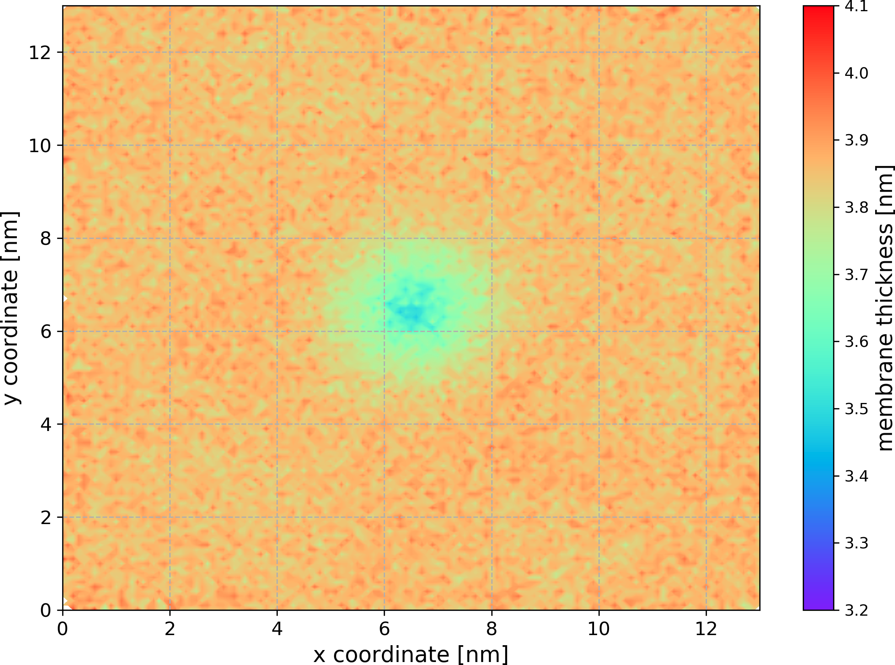

# memdian: Programs For MEMbrane DIsruption ANalysis

Memdian is a collection of several programs that might be useful for the analysis of membrane disruption. All the programs are built on top of [groan library](https://github.com/Ladme/groan) and can be used to analyze gromacs simulation trajectories.

The memdian programs have been written to analyze [Martini](http://cgmartini.nl/) simulations and the default values for options are set accordingly. You can however use memdian to analyze any simulation frames or trajectories in Gromacs format.

Note that when selecting beads (or atoms), memdian programs use the [groan selection language](https://github.com/Ladme/groan#groan-selection-language) that is very similar to the VMD selection language.

## Available programs

1) **memthick** calculates membrane thickness (phosphate-phosphate distance) across the entire membrane and writes the result as a plottable xy-map.
2) **wdcalc** calculates water defect: a number of water beads/molecules inside a specified cylinder.
3) **wdmap** calculates water defect across the entire membrane and writes the result as a plottable xy-map.

## Dependencies

Memdian programs require you to have groan library installed. You can get groan from [here](https://github.com/Ladme/groan). See also the [installation instructions](https://github.com/Ladme/groan#installing) for groan.

## Installation

### Install all memdian programs

1) Run `make groan=PATH_TO_GROAN` to compile all the memdian programs. `PATH_TO_GROAN` is a path to the directory containing groan library (containing `groan.h` and `libgroan.a`).
2) (Optional) Run `make install` to copy all the compiled binary files into `${HOME}/.local/bin`.

### Install a selected memdian program
1) Run `make NAME_OF_THE_PROGRAM groan=PATH_TO_GROAN` to compile a selected memdian program. For example, using `make wdmap groan=~/groan` will install the program `wdmap` while searching for the groan library in `~/groan`.
2) (Optional) Run `make install` to copy all compiled memdian programs into `${HOME}/.local/bin`.

## memthick

### How does it work

`memthick` generates a mesh for every membrane leaflet with bins every 0.1 nm and then calculates average z-position of phosphate atoms in each bin from the simulation trajectory. Membrane thickness is calculated for each bin as the difference between the average z-position of phosphates in the upper leqaflet bin and the average z-position of phosphates in the corresponding lower leaflet bin.

### Options

```
Usage: memthick -c GRO_FILE -f XTC_FILE [OPTION]...

OPTIONS
-h               print this message and exit
-c STRING        gro file to read
-f STRING        xtc file to read
-n STRING        ndx file to read (optional, default: index.ndx)
-o STRING        output file name (default: membrane_thickness.dat)
-l STRING        specification of membrane lipids (default: Membrane)
-p STRING        specification of lipid phosphates (default: name PO4)
-x FLOAT-FLOAT   grid dimensions in x axis (default: box size from gro file)
-y FLOAT-FLOAT   grid dimensions in y axis (default: box size from gro file)
-a INTEGER       NAN limit: how many phosphates must be detected in a grid tile
                 to calculate membrane thickness for this tile (default: 30)
```

When specifying 'lipid phosphates' using the `-p` flag, note that `memthick` expects one 'lipid phosphate' per lipid molecule. In all-atom simulations, it is recommented to select phosphorus atoms of the membrane lipids.

When using `memthick` to analyze a membrane-protein simulation, it is a good idea to center (and fit) the protein. Otherwise any interesting changes in the membrane thickness might get averaged out.

### Example

```
memthick -c system.gro -f md_centered_fit.xtc -l "resname POPC" -x 5-10 -y "3 - 12" -a 15
```

`memthick` will load information about the atoms (but not atom coordinates) from `system.gro`. Every simulation frame saved in the trajectory `md_centered_fit.xtc` will be analyzed. Analyzed part of the simulation box can be specified using the flags `-x` and `-y`. In this case, `memthick` will only analyze block-shaped area spanning from `5 nm` to `15 nm` on the x-axis and from `3 nm` to `12 nm` on the y-axis. The size of the area on the z-axis corresponds to the current size of the simulation box. Membrane thickness will not be calculated for bins with fewer than 15 samples (flag `-a`) in either leaflet.

All atoms corresponding to residues named `POPC` will be considered to be lipid atoms and will be used for the calculation of membrane center. Atoms named `PO4` (default option) will be considered to represent phosphates and their average position relative to the membrane center will be calculated. Lipids (or phosphates) are assigned to each leaflet based on their position relative to the membrane center. All phosphates currently positioned _above_ the membrane center of geometry will be assigned to the upper leaflet, while phosphates currently positioned _below_ the membrane center of geometry will be assigned to the lower leaflet. Assigning lipids to individual leaflets is performed for every frame of the trajectory.

The result of the analysis will be written into `membrane_thickness.dat` (default option) in the following format:
```
# SPECIFICATION OF THE PROGRAM USED AND ITS VERSION
# ARGUMENTS OF THE COMMAND LINE
# See average membrane thickness at the end of this file.
@ xlabel x coordinate [nm]
@ ylabel y coordinate [nm]
@ zlabel membrane thickness [nm]
@ grid --
$ type colorbar
$ colormap rainbow
X_COORDINATE1 Y_COORDINATE1 AVERAGE_THICKNESS_IN_THIS_BIN
X_COORDINATE2 Y_COORDINATE1 AVERAGE_THICKNESS_IN_THIS_BIN
X_COORDINATE3 Y_COORDINATE1 AVERAGE_THICKNESS_IN_THIS_BIN
...
X_COORDINATE1 Y_COORDINATE2 AVERAGE_THICKNESS_IN_THIS_BIN    <-- note that x-coordinate is the fastest changing
...
# Average membrane thickness: AVERAGE_THICKNESS_ACROSS_THE_MEMBRANE
```

All units in the output file are in nanometers.

Plotted xy map can look for example like this:



## Limitations of memdian programs

Memdian programs assume that the bilayer has been built in the xy-plane (i.e. the bilayer normal is oriented along the z-axis). 

Memdian programs will NOT provide reliable results when applied to simulations with curved bilayers or vesicles.

Memdian programs assume rectangular simulation box and periodic boundary conditions in all directions.

Memdian programs use center of _geometry_, instead of center of _mass_.

Memdian programs have only been tested on Linux and will probably not work on anything that is not UNIX-like.

